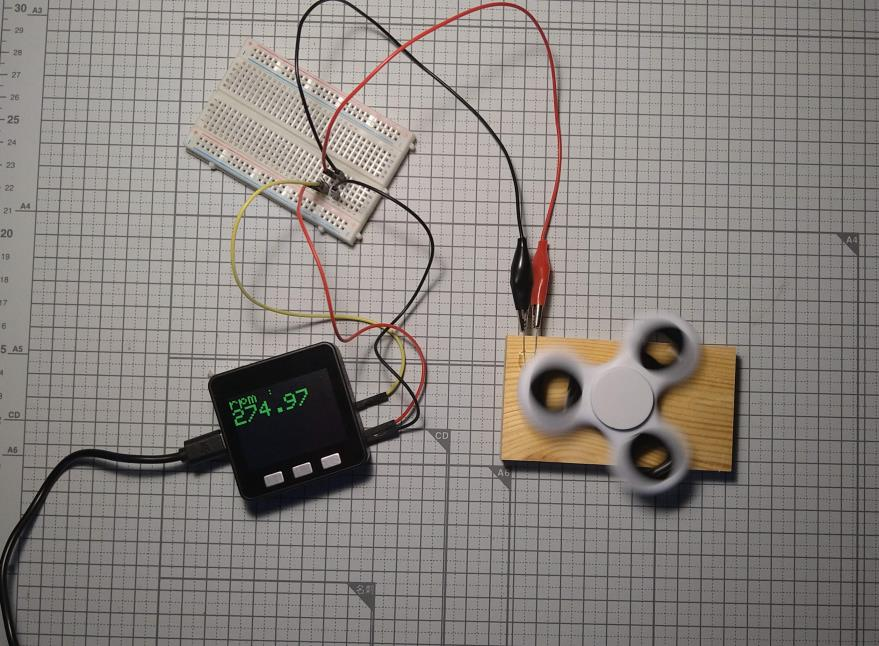
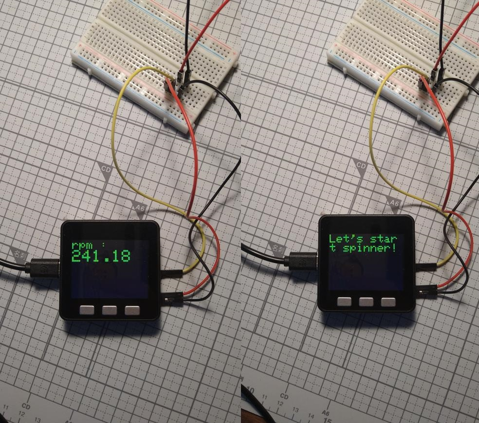
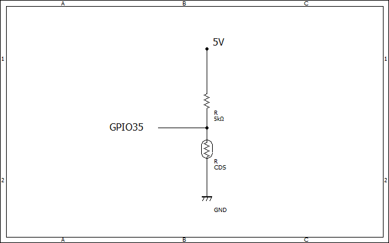

# handspinner_tachometer

## 概要 (Overview)

ハンドスピナー(handspinner,fidget)の回転数を測定します。 
光センサ(cds)でハンドスピナーの羽を検出し、FFT(Arduinoのライブラリを使用)で周波数を算出し、回転数を算出します。

## 画面イメージ (ScreenShot)

## 動作要件 (Requirements)

M5Stack / C++ / PlatformIO

## 技術的解説 (Technical explanation)

## 回路図 (Circuit diagram)

## ライセンス (License)

This software is released under the MIT License, see LICENSE.
